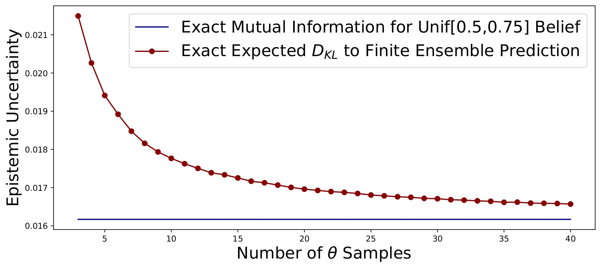
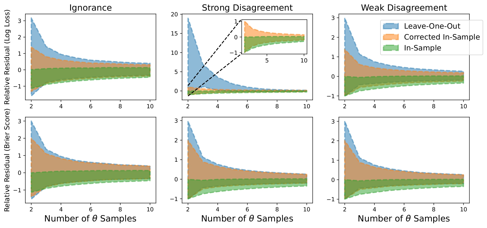

This blog is 100% human-written.   
## Introduction & Background 
In machine learning, predictive uncertainty arises in two ways: Imperfect knowledge about the data-generating process ("Epistemic Uncertainty"), and irreducible noise in the data-generating process ("Aleatoric Uncertainty").    In the classification setting, we use a function $$\mathcal{l}(\hat{\theta}, y)$$ to score the loss associated with the predicted probabilities for each class, $$\hat{\theta}$$, given the one-hot encoding of the true class, $$y$$. The aleatoric uncertainty can be defined as the expected loss under our predicted class probabilities which come from the learned model posterior $$Q$$\[1\]: 
$$\begin{equation} AU(Q) = \mathbb{E}_{\hat{\theta} \sim Q}\left[\mathbb{E}_{y \sim \hat{\theta}}[\mathcal{l}(\hat{\theta}, y)]\right]. \end{equation}$$
In words, aleatoric uncertainty quantifies the inherent uncertainty in the distribution over classes, under the model posterior[^1]. For example, if we use the negative log-likelihood $$\mathcal{l}(\hat{\theta}, y) = -\log(\hat{\theta}^Ty)$$, $$AU(Q)$$ is the expected entropy of $$\hat{\theta}$$.  
We can get an unbiased estimator for the aleatoric uncertainty using Monte Carlo simulation:
$$\begin{equation}
\widehat{AU(Q)} = \frac{1}{N}\sum_{i=1}^N S(\theta^{(i)}),
\end{equation}$$
where $$S(\cdot)$$ denotes, as our running example, the Shannon entropy.    
The epistemic uncertainty now is defined as the expected additional loss incurred by the use of the averaging estimator $$\bar{\theta}$$[^2]:
$$\begin{equation} EU(Q) = \mathbb{E}_{Q}\left[\mathbb{E}_\hat{\theta}[\mathcal{l}(\bar{\theta}, y)] \right]- AU(Q) \end{equation}$$
In the case of our running example, where $$\mathcal{l}$$ is the negative log-likelihood, $$EU(Q)$$ is the expected Kullback-Leibler divergence of $$\hat{\theta}$$ from $$\bar{\theta}$$,
$$\begin{equation} \mathbb{E}_{Q}\left[D_{KL}(\hat{\theta}||\bar{\theta}) \right]\end{equation}.$$
Again, we will have to resort to a sampling-based approximation to estimate this. For example, let us consider deep ensembles: Integration over the exact posterior is intractable, but we can sample it by training the same deep neural network architecture with different parameter initializations \[3\]. We obtain samples of the trained parameters $$\theta^{(1)}, \theta{(2)}, ..., \theta^{(M)}$$. However, assuming we want to use all of our samples for prediction, we cannot easily obtain an unbiased estimator of $$EU(Q)$$, due to the presence of $$\bar{\theta}$$ inside the expectation. This leads to two questions which this project aims to address:
1. Is $$\bar{\theta}$$, as used in our definition of epistemic uncertainty, $$\int_{Q} \theta d\theta$$ or $$\frac{1}{M}\sum_{i=1}^M \theta^{(i)}$$?
2. Once we've answered 1., how should we estimate $$EU(Q)$$? 

## Answering Question 1  
To begin, let us examine the impact of our choice for $$\bar{\theta}$$. As a toy example, we can have $$\theta$$ be the Bernoulli parameter and have $$Q$$ be $$U[\frac{1}{2}, \frac{3}{4}]$$. In this case, the below figure shows the discrepancy between the two induced estimation targets.

  

    
  

As we would expect, the finite ensemble-based target approaches the exact averaging estimator-based target from above: The expected KL-Divergence from the true mean of $$\theta$$ is smaller than the expected KL-Divergence from the sample mean, though the two will coincide asymptotically.   Which curve should we attempt to estimate? Here, we attempt to estimate the red curve, because we concern ourselves with predictive uncertainty: We want to compute a measure of uncertainty associated with the predictions coming from the model that we will actually use for prediction, not the model that we would use if we learned black magic to integrate over neural network training[^3]. 

## Answering Question 2  
We are now ready to define as the target for estimation
$$\begin{equation} \mathbb{E}_{\theta^{(M+1)}, \theta^{(1)}, \theta^{(2)}, ..., \theta^{(M)} \sim Q} \left[D_{KL}(\theta^{(M+1)}||\frac{1}{M}\sum_{i=1}^M \theta^{(i)}) \right]\end{equation}.$$

Currently, standard practice is the following, in-sample estimator:
$$\begin{equation} \frac{1}{M}\sum_{i=1}^M D_{KL}(\theta^{(i)}||\frac{1}{M}\sum_{j=1}^M \theta^{(j)}) \end{equation}$$
Clearly, this estimator will underestimate the target. In particular, its bias is given by:
$$\begin{equation} \mathbb{E}\bigg[D_{KL}(\theta^{(1)}||\frac{1}{M}\sum_{i=1}^M \theta^{(i)}))-D_{KL}(\theta^{(M+1)}||\frac{1}{M}\sum_{i=1}^M \theta^{(i)})\bigg] \\
= \mathbb{E}\bigg[\sum_{k=1}^K \big ( (\theta^{(M+1)}_k-\theta^{(1)}_k)\log (\sum_{i=1}^M \theta^{(i)}_k) \big)\bigg] \end{equation}.$$

Taking a first-order Taylor approximation of the logarithm around $$M \mathbb{E}_Q[\theta_k]$$ leaves us with
$$\begin{equation} \sum_{k=1}^K\frac{1}{M\mathbb{E}[\theta_k]}\cdot \mathbb{E}\bigg[\big(\theta^{(M+1)}_k-\theta^{(1)}_k\big)\sum_{i=1}^M \theta^{(i)}_k \bigg] \\
= -\sum_{k=1}^K\frac{Var_Q\big[\theta_k\big]}{M\mathbb{E}[\theta_k]}. \end{equation}$$

This approximation allows us to subtract the above from the in-sample estimator for an improved, first-order bias-corrected, estimator, though we will have to use the members of our ensemble to approximate the involved variance and expectation.   
Recall that the previous derivation is based on the log-loss as our choice of loss scoring rule. If we were to use the Brier score instead, we can obtain a closed-form expression for the bias exactly. The below table summarizes estimation targets and bias corrections. I hope to eventually extend this table to the zero-one loss and the spherical loss, however these are proving to be more tricky[^4]. 

| Scoring rule    | Estimation target | Bias approximation | Approximation type    |
| --------------- | ----------------- | ------------------ | --------------------- |
| Log-loss     | $$\mathbb{E}_{Q}[D_{KL}(\theta^{(M+1)}\|\|\frac{1}{M}\sum_{i=1}^M \theta^{(i)})]$$ | $$-\sum_{k=1}^K\frac{Var_Q\big[\theta_k \big]}{M\mathbb{E}\left[{\theta}_k \right]}$$ | First-order Taylor |
| Brier score  | $$\mathbb{E}_Q[\sum_{k=1}^K (\frac{1}{M} \sum_{i=1}^M \theta^{(i)}_k-\theta^{(M+1)}_k)^2]$$ | $$-\frac{2}{M}\sum_{k=1}^K Var_Q[\theta_k]$$ | Exact |

 An alternative approach to avoid the underestimation associated with the in-sample estimator is the leave-one-out estimator:
$$\begin{equation}\frac{1}{M}\sum_{i=1}^M  (D_{KL}(\theta^{(i)}||\frac{1}{M-1}\sum_{j\neq i}\theta^{(j)})).\end{equation} $$
Intuitively, this estimator will overestimate the target and suffer from large variance. Still, let us investigate it as an alternative/baseline to the bias-corrected estimator.  

Having established the undershooting in-sample estimator used in the existing literature as well as more careful alternatives, we are now ready to compare estimators empirically. Following the work of \[4\], we model a Bernoulli random variable, and investigate estimator performance on the following sources of epistemic uncertainty:
1. **Ignorance**, modelled by a $$U[0.2, 0.7]$$ belief over the Bernoulli parameter. The choice of uniform distribution does not affect the conclusions.
2. **Strong disagreement between hypotheses**, modelled by a $$\frac{1}{2}\delta((1-10^{-6})-\theta)+\frac{1}{2}\delta(10^{-6}-\theta)$$ belief.
3. **Weak disagreement between hypotheses**, modelled by a $$\frac{1}{2}\delta(0.56-\theta)+\frac{1}{2}\delta(0.55-\theta)$$. Shifting this Dirac mixture does not affect the conclusions.
 

  

    
  

  The residuals of the presented methods for both Log loss and Brier score are shown in the above figure. In all cases, the in-sample estimate leads to underestimation, and the leave-one-out estimate leads to overestimation. The corrected in-sample estimate does not suffer from as much bias. For modest sample sizes (6-10), the leave-one-out estimate is nearly as good as the corrected estimate, though it suffers from higher variance for smaller sample sizes. It is also unusually variable and biased on the Log loss epistemic uncertainty of a belief containing hypotheses which strongly disagree. These observations indicate that corrected in-sample estimators are preferable 
  

## Why should we care about (epistemic) uncertainty quantification?  

[^1]: This definition of aleatoric uncertainty has been criticized because it will be affected because of the learner's inability to learn a Dirac delta distribution for $$Q$$ from a finite amount of samples. Most often, the true $$\theta$$ will have a lower entropy than the average $$\theta$$ under $$Q$$, and we will therefore generally overestimate the true amount of irreducible noise in the data-generating process, as has been empirically demonstrated in \[2\]. However, the use of this definition remains standard practice.
[^2]: This too has been criticized, and this too remains standard practice.
[^3]: Bayesian neural networks can provide this black magic sometimes, but suffer from limitations such as even larger computational cost than deep ensembles.
[^4]: My mathematical ability and knowledge of statistics is rather limited as of yet, please contact me if you know how to obtain more/better corrections.
