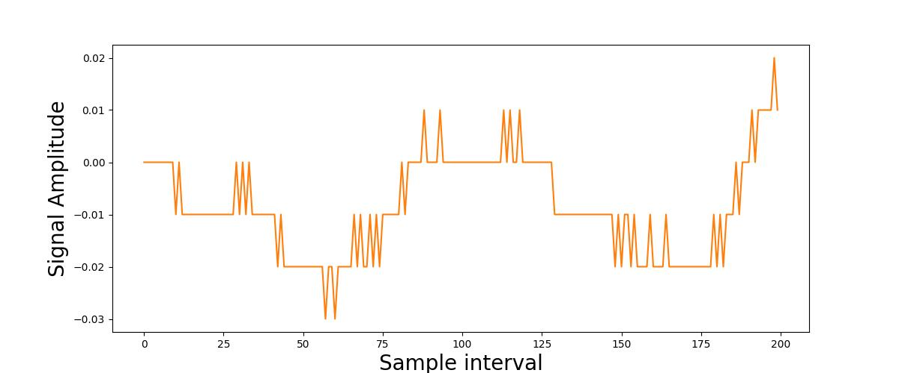
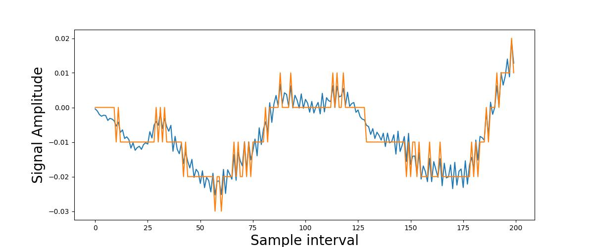
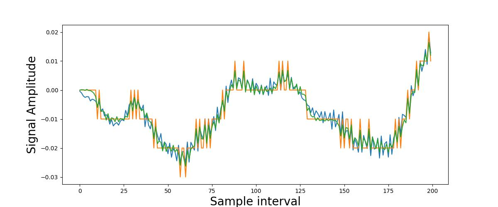

Below is a quantized time series - meaning that at each time point/sampling interval, its current value was rounded. This project was about estimating the original, unquantized, time series, using only the quantized time series that you see below.  
Click on the plot once to overlay the original time series, then click again to overlay the estimate.

  

    <!-- State 0: Quantized Only -->
    
    
    <!-- State 1: Quantized + Original (Hidden by default) -->
    
    
    <!-- State 2: Quantized + Original + Estimate (Hidden by default) -->
    
  

**What's happening?** 
This is only possible if we bias our search for possible reconstructions. We can do this by assuming that the unquantized time series was generated by an unknown autoregressive (AR(p)) process. Using only the orange curve, it's actually possible to identify the AR(p) model which generated the blue curve quite well. We can then use the identified model by applying particle smoothing to estimate the latent states (unquantized signal). At this point it is natural to ask whether this only works for AR(p) processes. Unfortunately, it is of course possible to construct time series on which the AR(p) assumption leads to very bad attempts at reconstruction. However, after having tried several model misspecifications as well as real-world data, I concluded that it generally does quite well on non-pathological stationary processes.
