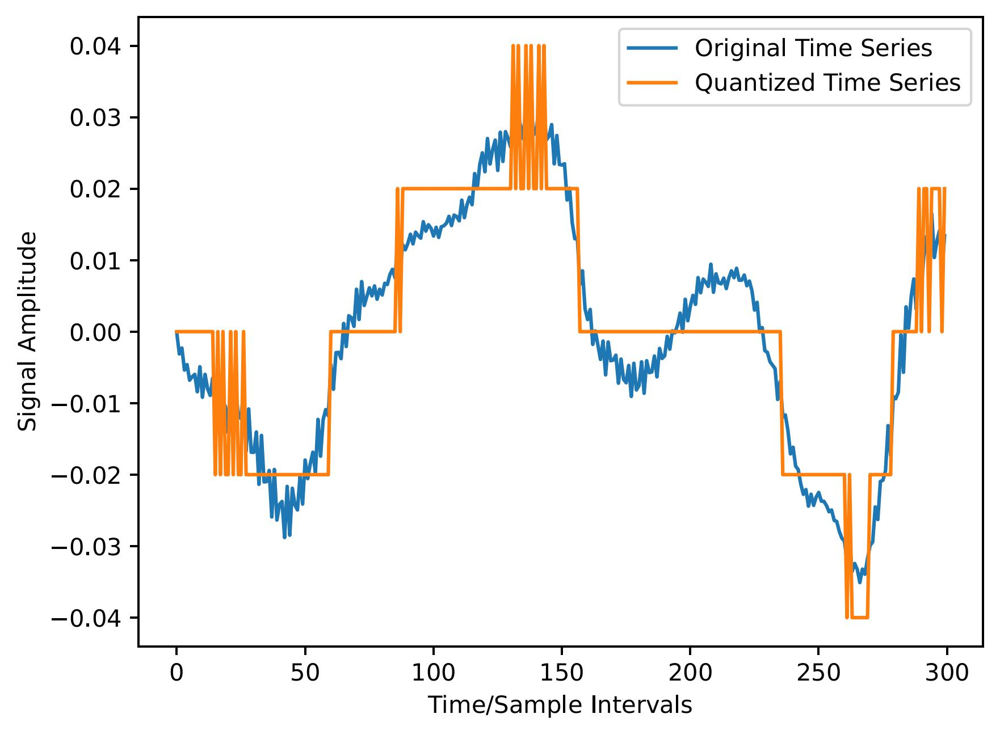

This article is 100% human-written.   

**Disclaimer**: To ensure quick readibility, some parts of this article are not fully rigorous, and others could be misleading for an audience unfamiliar with particle filtering and/or the EM algorithm. For a more precise treatment, please wait for a preprint or contact me for my bachelor's thesis.  
**Problem Statement**  
Time series are sometimes quantized, for example in order to save memory. For coarse quantization, this means that we lose quite a lot of information - or does it?

  

Attempting to reconstruct the blue curve using only the orange curve seems like an ill-defined problem, and in general, it is. But practically, we might be able to do quite well.  
**Reconstruction Bias**  
Analogously to the need of an inductive bias in machine learning, reconstruction requires a bias too: Given the quantized signal, there is an infinite number of possible reconstructions, so we need to specify a preference for some of them over others. We can do this by assuming a model class for the original time series, for example an autoregressive (AR) model:\begin{align}x_t = \sum_{i=1}^p \phi_i x_{t-i}+w_t, \quad w_t \sim \mathcal{N}(0, \sigma^2)\end{align}
Marginalizing over all possible autoregressive models will surely be intractable, so we need to use a point estimate of $$p$$, $$\{\phi_i\}$$, and $$\sigma^2$$. We can then use this point estimate to estimate $$x_{1:T}$$ from $$y_{1:T}$$ using state estimation methods. For now, it will be useful to assume that we have an estimate of $$p$$, $$\{\phi_i\}$$, and $$\sigma^2$$, and focus on the state estimation step. We will see how we can turn the ability to perform state estimation into a parameter estimation algorithm afterwards.    

**State Estimation** 
State estimation is the task of inferring the hidden, unobserved state $$x_t$$ of a system (e.g. the original values), using observations $$y_{1:T}$$ (e.g. the quantized values). For certain applications, it might be the case that we need to perform state estimation in real-time, meaning that $$T=t$$, as observations from future timepoints are not yet available. Real-time state estimation is often called *filtering*. The general case, where $$T\geq t$$, is called *smoothing*.  

Let us begin with the filtering problem, and then move on to smoothing.

*--- Particle Filtering ---*  
Particle filtering is a Monte Carlo method - that is, we use samples (which are often called particles) of $$p(x_{t}|y_{1:t})$$ to approximate $$\mathbb{E}[x_t|y_{1:t}]$$, our quantity of interest. To draw these samples, we begin by specifying some beginning target density that approximates $$p(x_1|y_{1})$$, and then inductively assume that we have i.i.d. samples of $$p(x_{t}|y_{1:t})$$.   To simulate $$p(x_{t+1}|y_{1:t+1})$$, we begin by drawing samples from $$p(x_{t+1}|x_t, y_{t+1})$$. This density is called the *optimal proposal density*, and it is not always easy (or necessary) to sample this density. It is not hard to see, that for our (AR(p), deterministic quantization) model, this distribution is a truncated gaussian, for which efficient sampling methods exist.  

After we we have drawn $$X_{t+1}^{i} \sim p(x_{t+1}|x_t, y_{t+1})$$, the $$X_{t:t+1}^i$$'s are jointly distributed according to $$p(x_{t+1}|x_t, y_{t+1})\cdot p(x_{t}|y_{1:t}) = p(x_{t+1}, x_t|y_{1:t+1})\cdot p(y_{t+1}|x_t)$$. This means that if we use $$p(y_{t+1}|x_t)$$ (the scaling factor of our truncated gaussian) to generate importance weights, resample the $$X_{t+1}^i$$'s according to these weights, the $$X_{t+1}^i$$'s will be distributed to our target distribution, $$p(x_{t+1}|y_{1:t+1})$$.   
This works perfectly fine, but nevertheless, there is something slightly disturbing about what we have done. If the variance of the importance weights is large, resampling will lead to a degenerate set of samples, meaning that our estimate of $$\mathbb{E}[x_{t+1}|y_{1:t+1}]$$, namely $$\frac{1}{N}\sum_{i=1}^N X_{t+1}^i$$, will suffer from high variance. To compensate, we will need a large number of samples, leading to higher computational cost. The disturbing part here is that the density we're resampling according to, $$p(y_{t+1}|x_t)$$, does not actually depend on $$x_{t+1}$$. In other words, our importance weight for $$X_{t+1}^i$$ doesn't actually depend on $$X_{t+1}^i$$, so we could have easily mitigated our problem associated with sample degeneracy, by simply switching the order of the sampling and resampling steps. That is, we resample the $$X_t^i$$'s we have by induction according to $$p(y_{t+1}|x_t)$$, and only then sample $$X_{t+1}^i$$. This has a name, and is called *auxiliary particle filtering*.  
Note: When our dynamics are linear with gaussian noise (and in some other cases), we can use the *Kalman filter* to track state expectations and covariances analytically. In our case, the severe non-linearity introduced by quantization prevents the successful application of Kalman filtering and its variants. 

**Particle Smoothing** 

**Parameter Estimation** 

**Order Estimation** 

**Results** 

